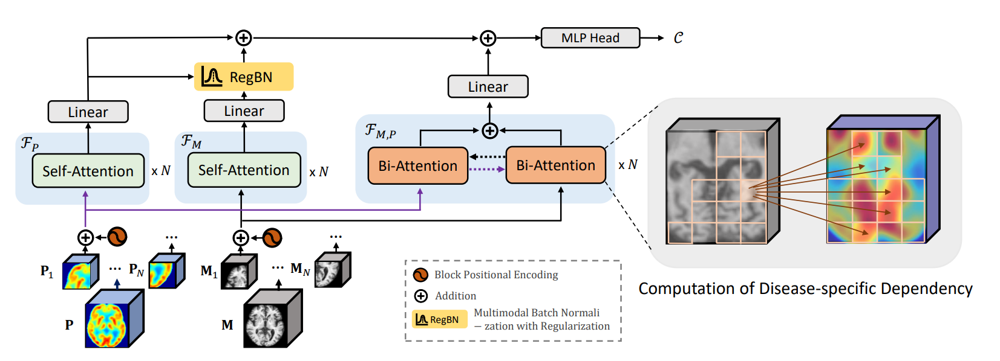

# Dementia Diagnosis with Multi-Modal Vision Transformers Using MRI and PET

Official Pytorch Implementation of Paper - 💎 DiaMond: Dementia Diagnosis with Multi-Modal Vision Transformers Using MRI and PET - Accepted by [WACV 2025](https://wacv2025.thecvf.com/)

[](https://arxiv.org/abs/2410.23219)



## Installation

### 1. Set up the environment

```bash
make env
```

### 2. Activate the environment

```bash
conda activate diamond
```

Note: If the environment already exists, it will not be recreated. To force update use:

```bash
make env-update
```

## Data

We used data from [Alzheimer's Disease Neuroimaging Initiative (ADNI)](https://adni.loni.usc.edu/) and [Japanese Alzheimer's Disease Neuroimaging Initiative (J-ADNI)](https://pubmed.ncbi.nlm.nih.gov/29753531/).

To prepare the data:

1. Download ADNI data manually and place in `data/raw/{train,val,test}` directories

2. Run data processing:

```bash
make data
```

Data for training, validation, and testing will be processed into separate [HDF5](https://en.wikipedia.org/wiki/Hierarchical_Data_Format) files, using the following hierarchical format:

1. First level: A unique identifier, e.g. image ID.
2. The second level always has the following entries:
   1. A group named `MRI/T1`, containing the T1-weighted 3D MRI data.
   2. A group named `PET/FDG`, containing the 3D FDG PET data.
   3. A string attribute `DX` containing the diagnosis labels: `CN`, `Dementia/AD`, `FTD`, or `MCI`, if available.
   4. A scalar attribute `RID` with the patient ID, if available.

## Usage

The package uses [PyTorch](https://pytorch.org). To train and test DiaMond, execute the `src/train.py` script.
The configuration file of the command arguments is stored in `config/config.yaml`.
The essential command line arguments are:

- `--dataset_path`: Path to HDF5 files containing either train, validation, or test data splits.
- `--img_size`: Size of the input scan.
- `--test`: _True_ for model evaluation.

After specifying the config file, simply start training/evaluation by:

```bash
python src/train.py
```

## Airflow Integration

DiaMond supports [Apache Airflow](https://airflow.apache.org/) for automated workflow orchestration. The following Make commands are available:

```bash
# Initialize Airflow environment
make airflow-init

# Start Airflow web server
make airflow-start

# Start Airflow scheduler
make airflow-scheduler

# Stop all Airflow processes
make airflow-stop

# Trigger the data processing DAG
make airflow-trigger

# Check status of DAGs
make airflow-status

# Set all required Airflow variables from your current configuration
make set-airflow-vars

# Run the complete DiaMond pipeline (processing + training)
make airflow-run-pipeline

# Open the Airflow web interface to monitor pipeline execution
make airflow-monitor
```

These commands enable you to schedule and monitor the entire DiaMond workflow from data preprocessing to model training using Airflow's powerful orchestration capabilities.

## Misc

This project uses:

- [Make](https://www.gnu.org/software/make/) for automation.
- [Airflow](https://airflow.apache.org/) for workflow orchestration.
- [Ruff](https://docs.astral.sh/ruff/) for code linting and formatting.
- [unittest](https://docs.python.org/3/library/unittest.html) for unit testing.
- [Hypothesis](https://hypothesis.readthedocs.io/en/latest/) for property-based testing.
- [PyTorch](https://pytorch.org/) for deep learning models.
- [Scikit-learn](https://scikit-learn.org/) for metrics and evaluation.
- [Wandb](https://wandb.ai/) for experiment tracking.
- [Nibabel](https://nipy.org/nibabel/) for neuroimaging data handling.
- [PyDICOM](https://pydicom.github.io/) for DICOM file handling.
- [dicom2nifti](https://github.com/icometrix/dicom2nifti) and [dcm2niix](https://github.com/rordenlab/dcm2niix) for DICOM to NIFTI conversion.
- [einops](https://github.com/arogozhnikov/einops) for tensor operations.
- [tqdm](https://tqdm.github.io/) for progress bar visualization.
